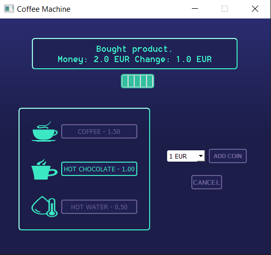

# Setting up the project
## Create a virtual environment and install packages.
To create the virtual environment (venv) type the following command in the terminal:
```
python -m venv venv
```
Activate the virtual environment:
```
venv\Scripts\activate
```
Install all required packages:
```
pip install -r requirements.txt
```

# How to use
Make sure that your virtual environment is activated, and then run the ```main.py``` script:
```
python main.py
```
After running the script, you should see the app's window:
<p align="center">

</p>

Now you can add coins and select a product.
<p align="center">

</p>

After that, you will receive information about a possible change. After a few seconds you will be able to add coins again and choose another product.
<p align="center">

</p>

